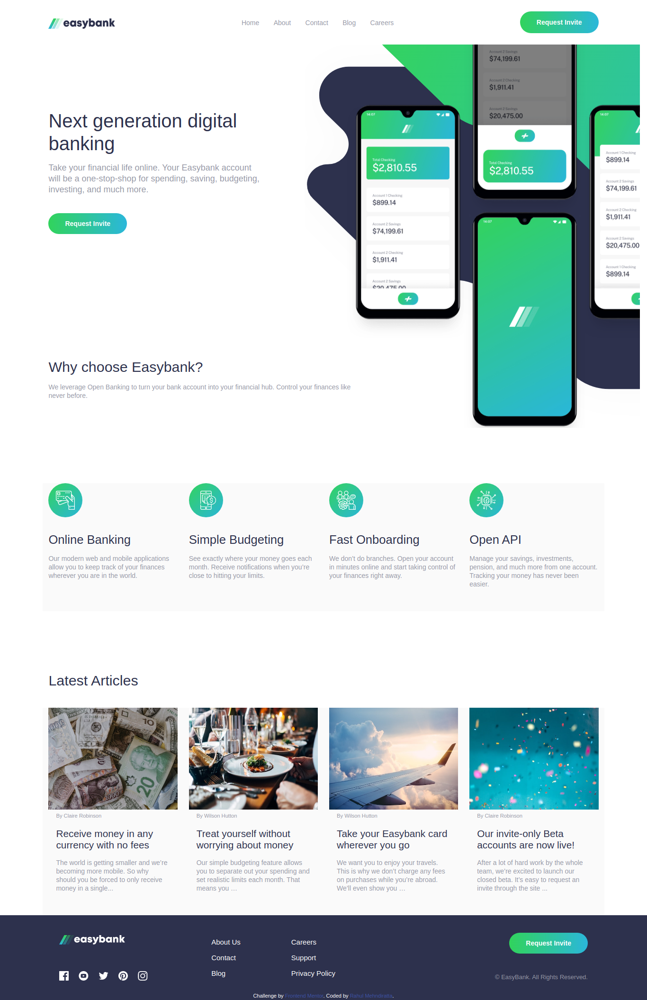
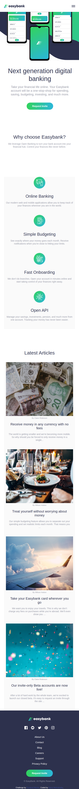

# Frontend Mentor - Easybank landing page solution

This is a solution to the [Easybank landing page challenge on Frontend Mentor](https://www.frontendmentor.io/challenges/easybank-landing-page-WaUhkoDN). Frontend Mentor challenges help you improve your coding skills by building realistic projects. 

## Table of contents

- [Overview](#overview)
  - [The challenge](#the-challenge)
  - [Screenshot](#screenshot)
  - [Links](#links)
- [My process](#my-process)
  - [Built with](#built-with)
  - [What I learned](#what-i-learned)
  - [Continued development](#continued-development)
  - [Useful resources](#useful-resources)
- [Author](rahulMehndiratta2602)
- [Acknowledgments](#acknowledgments)

## Overview

### The challenge

Users should be able to:

- View the optimal layout for the site depending on their device's screen size
- See hover states for all interactive elements on the page

### Screenshot

### Links

- Solution URL: [Add solution URL here](https://rahulmehndiratta2602.github.io/Easybank-Landing-page/src/index.html)
- Live Site URL: [Add live site URL here](https://rahulmehndiratta2602.github.io/Easybank-Landing-page/src/index.html)

## My process

### Built with
HTML,SCSS(CSS with superpowers),JavaScript and DOM.

### What I learned

Before this project I had no knowledge of scss.I always used css to build web pages.I wonder if I am ever going to use css again.

### Continued development

I will be focussing on adding functionality to this website using NodeJS and ExpressJs and database conectivity using MongoDB.

### Useful resources

-(https://youtu.be/aoQ6S1a32j8) - This helped me for whenever I got stuck. I really liked her teaching pattern and will use it going forward.

## Author

- Website - [Rahul Mehndiratta](https://rahulmehndiratta2602.github.io/Portfolio-Website/src/index.html)

## Acknowledgments

Jessica Chan https://youtu.be/aoQ6S1a32j8

